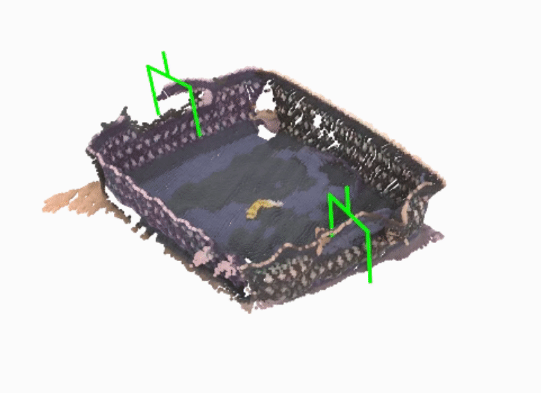
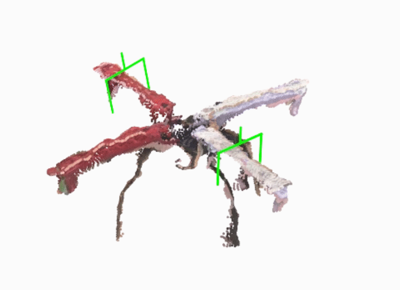
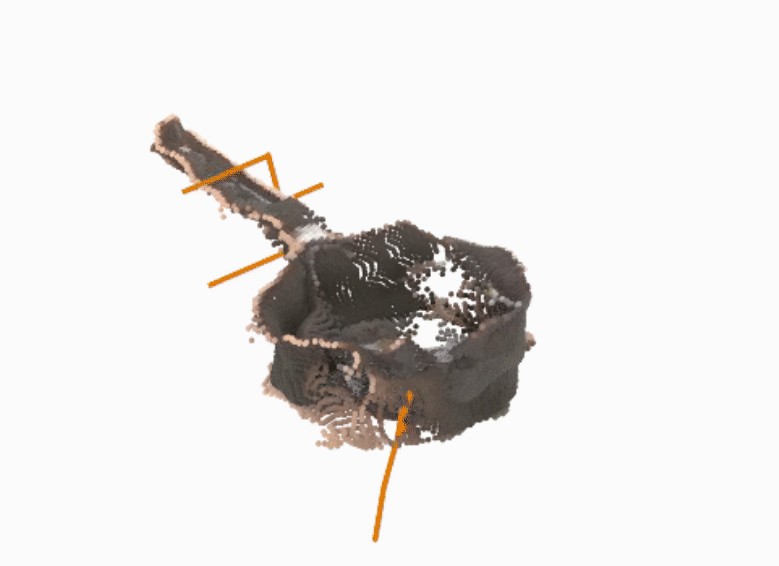

<!-- # DAGDiff: <ins>D</ins>ual-<ins>A</ins>rm <ins>G</ins>rasp <ins>Diff</ins>usion -->
# DAGDiff: Guiding Dual-Arm Grasp Diffusion to Stable and Collision-Free Grasps

<h3>Accepted at ICRA 2026</h3>

This is the official repository for DAGDiff: Guiding Dual-Arm Grasp Diffusion to Stable and Collision-Free Grasps. The codebase and the documentation is still in progress. <br>

Check the <a href="https://dag-diff.github.io/dagdiff/">[Project Website]</a> for more results and updates.

<div style="display:flex; gap:12px; flex-wrap:wrap;">
  
  
  
</div>

<!-- <div style="margin: 12px"></div>

<center>
    <div style="width: 420px; height: 10px; border-radius: 999px; background: linear-gradient(to right, #ff0000, #ffff00, #00ff00);"></div>
    <div style="width: 420px; display: flex; justify-content: space-between; font-size: 13px; margin-top: 4px;">
    <span>Unstable grasp pairs</span>
    <span>Stable grasp pairs</span>
    </div>
</center> -->

## TODO
- [x] : Add visualization notebook
- [ ] : Update code documentation
- [x] : Refactor training and eval code
- [x] : Push inference code and model checkpoint
- [x] : Conda env working fine 
- [x] : Initial release


## 1. Installation

### Creating the Conda Env
Run the following commands

```sh
conda create --name dagdiff -y python=3.8
conda activate dagdiff
```

Install Packages
```sh
conda install -c "nvidia/label/cuda-11.8.0" cuda-toolkit
pip install torch==2.0.1+cu118 torchvision==0.15.2+cu118  torchaudio==2.0.2+cu118 --extra-index-url https://download.pytorch.org/whl/cu118
pip install torch-scatter -f https://data.pyg.org/whl/torch-2.0.1+118.html # will take some time to install 
conda install conda-forge::suitesparse
conda install -c conda-forge scikit-sparse
pip install theseus-ai==0.1.3
```

Install remaining packages
```sh
pip install -r requirements.txt
pip install -e . # installing se3dif module
pip install huggingface_hub
```

## 2. Download Dataset
Run the following command to download the dataset from huggingface (or get it manually from <a href="https://huggingface.co/datasets/faizalkarim/dagdiff-dataset">faizalkarim/dagdiff-dataset</a>).
```sh
huggingface-cli download faizalkarim/dagdiff-dataset --repo-type dataset
```

Unzip the folders (grasps.zip, meshes.zip, sdf.zip) and the final folder should look like:

```
dagdiff-dataset
├── train_final.txt
├── test_final.txt
|
├── grasps/
│   ├── 554fa306799d623af7248d9dbed7a7b8.h5
│   ├── c2ad96f56ec726d270a43c2d978e502e.h5
│   ├── ....
|
├── meshes/
│   ├── 554fa306799d623af7248d9dbed7a7b8.obj
│   ├── c2ad96f56ec726d270a43c2d978e502e.obj
│   ├── ....
|
└── sdf/
    ├── 554fa306799d623af7248d9dbed7a7b8.h5
    ├── c2ad96f56ec726d270a43c2d978e502e.h5
    └── ....
```

Use <a href="https://github.com/DAG-Diff/dual-arm-grasp-diffusion/blob/main/notebooks/viz_dataset.ipynb">viz_dataset.ipynb</a> to visualize the the dataset.

## 3. Inference

For inference, first download the model checkpoint from <a href="https://iiithydresearch-my.sharepoint.com/:u:/g/personal/md_faizal_research_iiit_ac_in/EegOVM7li5xAsG7fFH9B4OIB07OSM7INiTIQDmiWpeRoFw?e=qU2po1">link</a> and place it in `./checkpoint` directory. The same path needs to be provided in `./configs/dual_arm_params.yaml` as <b>inference_checkpoint</b>. Two example object meshes are stored in `./try_meshes` directory which can be used to run the model. 

Once done, run the following command to generate dual-arm grasps. 

```sh
CUDA_VISIBLE_DEVICES=0 python3 scripts/sample/generate_dual_6d_grasp_poses.py \
--n_grasps 300 \
--model dual_arm_params \
--input ./try_meshes/monitor.obj
```

Use <a href="https://github.com/DAG-Diff/dual-arm-grasp-diffusion/blob/main/notebooks/viz_grasps.ipynb">viz_grasp.ipynb</a> to visualize the generated grasps and the denoising trajectory.

## 4. Training 

First, copy the path of the data dir in <a href="https://github.com/DAG-Diff/dual-arm-grasp-diffusion/blob/main/configs/dual_arm_params.yaml">dual_arm_params.yaml</a> as given below.

```yaml
grasps_dir: <PATH>/dagdiff-dataset/grasps/
meshes_dir: <PATH>/dagdiff-dataset/meshes/
sdf_dir: <PATH>/dagdiff-dataset/sdf/
train_meshes_list: <PATH>/dagdiff-dataset/train_final.txt/
val_meshes_list: <PATH>/dagdiff-dataset/test_final.txt/
```

Train the model using the command:

```sh
python3 trainer_script.py --config dual_arm_params.yaml
```
Start the training from a pretrained checkpoint by specifying the checkpoint path in <a href="https://github.com/DAG-Diff/dual-arm-grasp-diffusion/blob/main/configs/dual_arm_params.yaml">dual_arm_params.yaml</a>. It also contains other hyperparameters which can be modified as required. 

```yaml
pretrained_checkpoint:
    path: <PATH to checkpoint>
    to_load: ['all'] # or ['none', 'vision_encoder', 'feature_encoder', 'dual_energy_net', 'classifier', 'collision_predictor']
```

## 5. Research Progression  

Our research is part of a continuing line of projects. To see how it has developed over time, take a look at our earlier works:

```
[1] CGDF ───────────────┐
           |            |  
           |            v
           ├─────> [3] DG16M ────> [4] DAGDiff
           |
           |
[2] DAVIL ─┘
```
<details>
<summary>References</summary>

- **[1] CGDF**  
  G. Singh et al., *“Constrained 6-DoF Grasp Generation on Complex Shapes for Improved Dual-Arm Manipulation”*, IROS 2024.  
  https://ieeexplore.ieee.org/abstract/document/10802268

- **[2] DAVIL**  
  M. F. Karim et al., *“Da-Vil: Adaptive Dual-Arm Manipulation with Reinforcement Learning and Variable Impedance Control”*, ICRA 2025.  
  https://ieeexplore.ieee.org/abstract/document/11127487

- **[3] DG16M**  
  M. F. Karim et al., *“DG16M: A Large-Scale Dataset for Dual-Arm Grasping with Force-Optimized Grasps”*, IROS 2025.  
  https://ieeexplore.ieee.org/document/11246970

- **[4] DAGDiff**  
  M. F. Karim et al., *“DAGDiff: Guiding Dual-Arm Grasp Diffusion to Stable and Collision-Free Grasps”*, ICRA 2026.  
  https://arxiv.org/abs/2509.21145

</details>


## 6. Acknowledgment
Our codebase is built upon the existing works of <a href="https://sites.google.com/view/se3dif">SE(3)-diff</a> and <a href="https://constrained-grasp-diffusion.github.io/">CGDF</a>. We thank the authors for releasing the code.

## 7. 📜 Cite
```
@article{DAGDiff,
      title={DAGDiff: Guiding Dual-Arm Grasp Diffusion to Stable and Collision-Free Grasps}, 
      author={Md Faizal Karim and Vignesh Vembar and Keshab Patra and Gaurav Singh and Nagamanikandan Govindan and K Madhava Krishna},
      year={2026},
      eprint={2509.21145},
      url={https://arxiv.org/abs/2509.21145}, 
}
```

